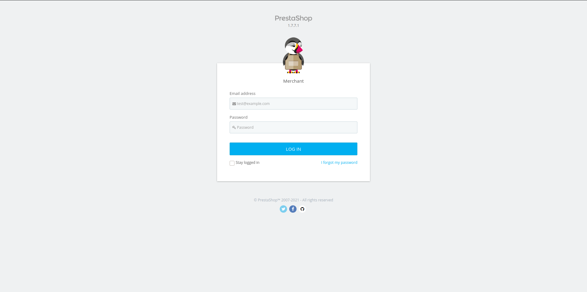
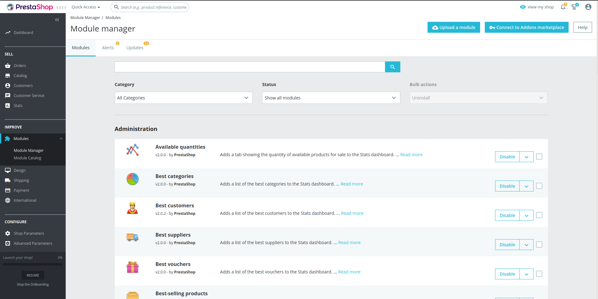
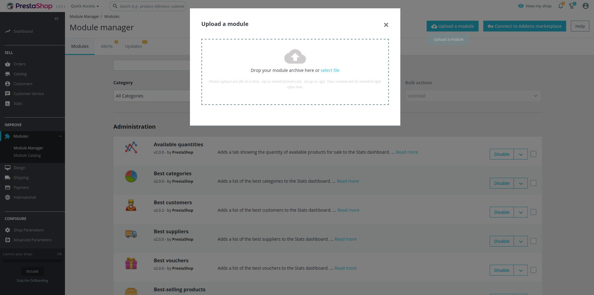
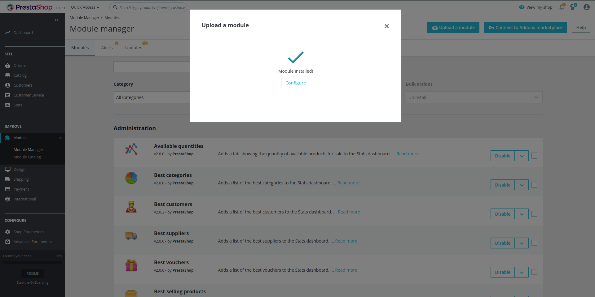
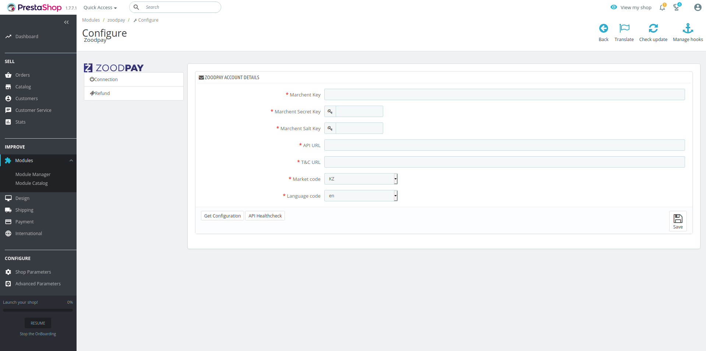
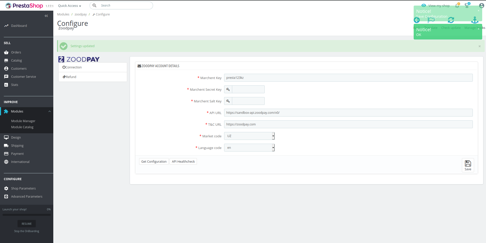

# ZoodPay PrestaShop Payment Module
[](LICENSE.md)

ZoodPay Buy Now Pay Later Payment Module for the PrestaShop

[ZoodPay API Documentation](https://apidocs.zoodpay.com/)

## Installation

```
1. Log in to your website’s admin.   Ex: your-website.com/admin
```

```
2. In the left sidebar, Navigate to Modules > Modules Manager. 
```


```
3. Click Upload New
4. Locate the package that you Downloaded.
```

```
5. Verify that ZoodPay Module Installed
```


## Usage

```
1. In the left sidebar, Navigate to Modules > Modules Manager.
2. Find ZoodPay Module. 
3. Click the Configure.
```

```
4. Set Merchant Key as received from the ZoodPay Business Team.
5. Set Merchant Secret Key as received from the ZoodPay Business Team.
6. Set Merchant Salt Key as received from the ZoodPay Business Team.
7. Set API URL as received from the ZoodPay Business Team.
8. Select Market Code Based on your Country.
9. Select Language Code Based on your Preference.
10. Click Save Changes.
11. Verify API Health by Clicking on the API HealthCheck button.
12. Click Fetch Configuration
```



## Changelog
Please see [CHANGELOG](CHANGELOG.md) for more information what has changed recently.

## Contributing
Please see [CONTRIBUTING](CONTRIBUTING.md) for details.

##Support
For any inquiry write to integration@zoodpay.com with a detailed description of the issue.
## Credits
- [ZoodPay](https://github.com/orientswiss)
## License
The Open Software License (OSL 3.0). Please see [License File](LICENSE.md) for more information.
